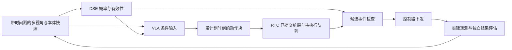

**面向 VLA 抓取的显式状态先验：研究收敛与工作验证流程**

版本：2026-09-24。依据：四个本地目录的源码、配置、样例元数据，以及本轮查阅的论文原文/作者项目页。本文是待执行方案，不代表已经训练、复现或完成真机验证。文中的样本量、阈值和阶段预算均为设计起点，不是经过实验确定的最优值。

当前默认范围：Tron2 平行夹爪、固定底盘和头部、先单臂桌面抓取放置，再扩展双臂；保留三路相机。GPU、已有 checkpoint、现有真机成功率和遥测可用性尚待确认。另一只手臂可以保持固定，但所有模型使用一致的动作维度与执行规则。

**1. 研究判断：保留问题，收窄“确定性”和创新主张**

这个方向值得做最小验证，但“从夹爪信号获得阶段标签，再训练小模型辅助 VLA”已与多项工作重叠。现阶段不宜以“首次利用显式确定性状态”作为论文贡献。

建议把核心问题改为：在夹爪物理开度相同、目标与相对几何不同的条件下，在线估计器能否识别开合事件的可执行条件；这些经过校准且带时效的信息，在相同数据、监督、历史信息和执行预算下，是否比辅助监督或简单动作后处理更有效？

可用工作标题：**面向异步 VLA 抓取的可校准夹爪事件先验与选择性执行**。是否保留“异步”取决于时效/队列实验是否形成实质贡献；若只验证条件注入，就不要把 RTC 集成写成算法创新。

必须修正原始论证的五点：

- 当前实际开度已经在本体状态中，重复提供开度不一定增加任务信息。“当前是张开”与“现在应闭合”是两个预测问题。
- 人看图也未必能确定接触、摩擦、遮挡后物体状态；离散输出和确定性推理程序不等于状态真值确定。DSE 应输出概率、有效性和拒答，而不是把每帧强行二分类。
- 视觉编码可能损失信息，但不能直接据此断言它是提前闭合的原因。需要检查控制延迟、相机同步、示教偏差、类别不均衡和动作损失等竞争解释。
- 语言决定抓哪个物体、放到哪里和什么时候释放。主问题可以固定任务语言以控制变量，但多物体实验中 DSE 应接收任务/目标条件。
- 若 X 已包含与 DSE 完全相同的图像、状态、历史和任务信息，且 z=f(X)，则 I(A;z|X)=0。合理解释是改善有限模型的表示、优化或控制结构，而非凭空增加信息。若 DSE 多用历史、遥测、预训练数据或高分辨率裁剪，必须单独控制这些额外来源。

“动作歧义降低”应操作化为接触前事件时机更准确、无效开合更少，并辅以多次动作采样的分析。不能仅以输出方差降低为证据，因为始终不闭合也能降低方差。

**2. 与相关工作的边界**

以下是截至本次检索的高相关工作，属于有针对性的检索，不是穷尽性新颖性保证。正式投稿前应更新。

| 工作 | 已覆盖的能力 | 对本研究的约束 |
|---|---|---|
| [StaKe，2026](https://arxiv.org/html/2606.26801v1) | 从演示夹爪状态自动构造阶段和下一开合关键帧监督；在 π0.5 上增加训练辅助头 | 必须设置阶段/关键帧辅助监督强基线，不能把自动阶段标注或辅助头单独当新贡献 |
| [FPC-VLA，2025](https://arxiv.org/html/2509.04018v2) | 在夹爪状态变化时由视觉语言监督器判断动作适宜性并给出修正，另有动作融合 | “闭合前检查”也已有先例；需证明校准、时效处理、低延迟或同预算控制效果的具体增量 |
| [CLAW，2025](https://arxiv.org/html/2509.14143v1) | 独立 CLIP 模型判断重量条件，生成离散指令引导 π0 | “小模型提取显式条件再喂给 VLA”的一般架构并不新；区别应在事件语义及验证机制 |
| [DAM-VLA，2026](https://arxiv.org/html/2603.00926v1) | 区分机械臂移动与夹爪操作，进行动作模型路由和加权 | 夹爪/机械臂解耦不能自动构成贡献；简单解耦头需要作为控制组 |
| [ECoT，2024](https://arxiv.org/abs/2407.08693) | 显式计划、子任务和视觉落地的中间推理 | 应区别紧凑事件先验与一般语义阶段/推理 token |
| [执行状态监测与恢复，2026](https://arxiv.org/abs/2604.07395) | 从夹爪遥测形成结果事件并驱动有限次恢复 | 检测失败和执行恢复属于不同模块，均不能以闭合命令代替成功判定 |
| [BATON，2026](https://arxiv.org/html/2608.16889v1) | 通过视觉验证准备条件后调用接触技能，并处理子任务交接 | “具备条件才执行”不是全新的范式；本研究应限定到低层事件、学习和时效的证据 |
| [RTC](https://arxiv.org/abs/2506.07339)、[训练时 RTC](https://arxiv.org/abs/2512.05964) | 已提交动作前缀条件化及异步动作块执行 | 同一算法比较必须使用相同 RTC 设置，随后再做 DSE×RTC 交互实验 |
| [PACE，2026](https://arxiv.org/html/2606.00537v2) | 根据动作阶段调整 chunk 执行长度 | 如果提出阶段触发重规划，需排除增益只是来自更频繁重规划 |

优先复现同一 π0.5 主干上的 StaKe 类基线、事件检查基线、简单夹爪解耦头。FPC 等方法若缺少可用代码或无法忠实适配，应明确命名为“参考该思想的实现”，不宣称复现了原论文。G0.5 用于后续第二主干验证，不应在第一阶段把大部分资源耗在平台迁移上。

最有说服力的候选贡献是：**区分开度与事件可执行性；用因果输入、困难反例与校准建立可信先验；证明该先验在真实反馈和异步执行中提供超出同监督辅助任务、解耦头和规则后处理的收益。** 这仍是待实验检验的研究定位。

**3. 变量定义与可证伪假设**

每只夹爪分别维护以下变量，双臂扩展时再增加交接关系，避免用“任一夹爪闭合”代替全局阶段：

| 变量 | 含义 | 数据来源/边界 |
|---|---|---|
| w_t | 实测开度及变化率 | 遥测；与目标指令分开 |
| u_t | 已下发/示教目标开度 | 命令日志；不意味着已执行到位 |
| e_t | 当前候选事件：保持、闭合、释放 | VLA 候选动作、当前命令和去抖规则 |
| r_close、r_release | 当前局部状态是否满足相应事件条件 | 视觉、目标、本体及历史；允许 unknown |
| h_t | 是否持有目标物体/是否疑似滑落 | 物体随动、开度/力信息等证据；不能仅看 u_t |
| p_t | 操作阶段 | 标签定义允许回退、重试和失败状态 |

建议形式：

\[
X_t=(o^{1:V}_{t-K:t},s_{t-K:t},a^{sent}_{t-K:t-1},l),\qquad
z_t=D_\phi(X_t).
\]

\[
z_t=(p(p_t),p(r_{close}),p(r_{release}),p(h_t),valid_t,age_t),\qquad
A_t\sim\pi_\theta(A\mid o_t,l,s_t,z_t).
\]

历史命令只允许到 t-1；动作 a_t 和未来反馈是训练目标/事后标签，不能作为在线输入。时间 t 对应哪个传感器快照必须明确。若准备条件取决于未来机械臂轨迹，则“当前 readiness”不足以验证整个动作块；应限定为下一次实际开合事件，或另建显式条件于候选轨迹的预测器，并独立验证。

首轮可把 close-ready 的操作定义固定为：“在当前候选抓取位姿，执行规定的闭合与短距离提起协议，是否有足够证据预期持有指定目标”。闭合速度/力度、提起方向及结果判据固定。人工可见性标签检查目标身份、夹指相对位置、抓取高度、明显障碍与可见性；真实成功概率则只由执行了该协议的试验结果监督。两类标签分别命名，不能把人工判断直接称为物理成功真值。当前位姿未固定、物体仍在移动或证据不可见时可标 unknown。

预注册四个假设：

- H1：相同实际开度下，带视觉/目标的 DSE 对事件可执行性的判断优于仅本体、阶段时钟和当前开度分类器。
- H2：在相同演示、标签和训练预算下，在线显式先验提高首次抓取成功率，且不以明显降低最终任务成功率为代价。
- H3：校准、拒答和时效检查在噪声/遮挡/延迟下改善错误事件率与完成率的权衡，且优于固定去抖和等频率重规划。
- H4：保留恢复数据后，方法在统一的失败起始状态上改善恢复；若只改善首次成功而无恢复增益，应缩小论文主张。

**4. 数据与标签：先建立事件真值，再训练模型**

本地样例可用于接口验证：14 条轨迹、13,432 帧、30 FPS、18D、单一 banana 任务，约 7.46 分钟。v2.1/v3.0 的 14 对 state/action/timestamp 完整压缩列块已逐列比对一致，应分配同一 source_episode_uuid；两版文件顺序还存在反转，不能仅按文件编号连接。参见 [v2.1 元数据](/Users/yannlau/Documents/ProjectRepository/tron2_dataset/lerobot_v2.1_examples/meta/info.json)、[v3 元数据](/Users/yannlau/Documents/ProjectRepository/tron2_dataset/lerobot_v3_examples/meta/info.json)。

先完成以下数据契约：

1. 固定物理布局、单位、相机名称、目标命令与反馈的语义。样例夹爪位于 0-based 7、15；代码仍应按 layout 名称查找，不能写成所有机器人的通用索引。
2. 样例 state 头部 pitch 约 0.8932–0.8945，action 头部两维恒为 0，需回查采集/转换含义。若首轮固定头部，明确生成 state/action 同步裁为 16D 的派生视图并重新计算统计量；不要只在服务端截掉维度。
3. 核对 MCAP 到 LeRobot 的 action 是当前目标、上一已发目标还是未来移位目标。通过命令、反馈和视频三方对齐估计执行滞后；不得把未来反馈提前成 state。用训练/校准数据确定延迟补偿规则并固定到测试集。
4. 对照 sensor timestamp、接收时间、单调时钟；若没有可靠采样时间，只能报告接收年龄。不能跨机器直接相减未同步的 monotonic timestamp。
5. 原始 MCAP 保留；转换数据附版本、source UUID、帧映射与质量报告。当前 LeRobot schema 没有独立夹爪电流字段，不能假设电流可用；先核查真机遥测再决定是否新增。

自动标注分三层，不能将它们合并为一个二值标签：

- **L0 物理/命令事件。** 逐夹爪标定空载全开、全闭、夹持不同宽度物体的范围；分别保存连续 w/u，再用两阈值滞回和最短持续时间提取命令开合事件。0.3/0.7 等只能是待校准的初值；夹持物体时实际夹爪可能停在中间开度。
- **L1 阶段弱标签。** 利用命令事件、机械臂运动和物体随动生成 approach/align/close/verify/transport/release/recover/unknown。仅从 open/close 无法唯一划分这些阶段，边界不清的样本应保留 unknown、区间边界和 valid mask。
- **L2 准备条件与结果标签。** “演示此刻发出了闭合”只证明操作者意图，不能证明闭合必然正确。构造闭合前困难样本：相同开度但位置偏移、目标移走、错误目标、不同高度/姿态、遮挡；由独立标注规则与人工复核判定允许/不允许/无法判断。抓取后结果另用提起后的持有/随动证据标注。

事后视频可以协助定位接触和结果，但未来成功不能反向证明更早任意帧已 ready。若训练“此刻闭合的成功概率”，结果只对实际执行的局部操作直接可知；未执行帧是未观测反事实。可通过受控局部试验/仿真补覆盖，其余仅用人工可见性标签或设 unknown。

两名标注者对分层抽样事件窗盲标，不看模型预测，记录分歧并裁决。统计事件级一致率/κ、边界偏差和各类误差，不能只抽稳定保持区间。自动标注质量应在冻结的人工审计集上评估；不按 DSE 置信度筛出一个容易的测试集。

建议旁路标签文件以 source_episode_uuid + frame_index/timestamp 连接，避免直接破坏 LeRobot 主数据。字段最少包括：

```text
source_episode_uuid, session_id, object_instance_id, scene_id, task_id
frame_index, sensor_time_ns, receive_time_ns, sensor_time_valid
arm_id, aperture_observed, aperture_commanded, previous_sent_command
event_type, phase_label, close_ready_label, release_ready_label, held_label
label_valid_mask, label_source, annotation_version, annotator_agreement
event_window_id, attempt_id, outcome, recovery_segment, behavior_clone_valid
split, duplicate_group_id
```

缺失字段显式无效，不以 0 代替 unknown。双臂共享 episode 身份，各自保留事件。事件窗重采样时记录采样权重，测试分布保持自然发生频率。

划分先于切帧、增强、标注器拟合和统计量计算。按原始 episode 分组，按实验目的进一步留出物体实例、场景、日期/采集 session；同一 episode 的恢复片段与重录版本不得跨集合。训练/选择/校准/测试四池可以从 60/15/10/15 起步，但以组完整性为先。归一化只用训练池，温度/阈值只用校准池，最终测试不用于模型选择。

**5. DSE 训练及失败数据的用途**

先训练三个逐步增加信息的估计器：state-only；三视角单帧+state+任务；相同输入加因果短历史。视觉分支共享轻量编码器，可先冻结预训练编码器，只训练融合/时间聚合/输出头。先采用与 VLA 相同相机和 224×224 输入，避免把分辨率收益误写成语义收益。引入物体裁剪或更强预训练时必须补同资源对照。

输出为多任务概率与 unknown/valid；分别监督阶段、close-ready、release-ready、held。阶段是辅助上下文，close-ready 是首轮主目标。若首轮只验证 close-ready，保留原策略释放行为，并明确不声称改善释放。

按事件窗而非帧数平衡训练，避免 99% 保持状态掩盖事件错误。训练时因果历史可尝试 0.2/0.5/1.0 秒，值仅在开发集选择；episode 边界重置历史，不用未来帧填补缺失。对齐、图像增强、状态扰动需要保持标签有效性；不能随机平移图像后仍把细粒度相对几何标签视为严格真值。

评价指标至少有事件级 precision/recall、AUPRC、误允许闭合率、ready 检出延迟、Brier/NLL、校准曲线和 risk–coverage 曲线。softmax 最大值不是可靠性证明。温度缩放可作最低成本校准基线，但不能保证 OOD 可靠，需分别画移位后的可靠性曲线。参考 [Guo 等的校准研究](https://proceedings.mlr.press/v70/guo17a.html)。

必须纳入失败与重试数据：它们提供“夹爪关了但没抓到”“需要回退到接近阶段”的关键反例。只有成功演示的 DSE 很容易把时间进度或闭合动作误当成功。

| 数据片段 | 用于 DSE | 用于策略行为克隆 |
|---|---|---|
| 一次成功的专家片段 | 是，核验事件标签 | 是 |
| 成功恢复的专家操作片段 | 是，包含阶段回退 | 是，作为恢复示教 |
| 导致失败的错误动作 | 是，作为反例/失败结果 | 不应无差别作为理想动作；设 mask 或独立权重 |
| 自动执行后失败但无人修正 | 可用于检测/结果学习 | 不自动视作恢复示教 |
| 原因不明/不可见 | unknown 或仅训练已知标签 | 按行为质量决定，不能强赋 ready |

策略第一阶段用通用、有效的演示与恢复片段建立共同 checkpoint。第二阶段保持相同采样集合，并混入恢复回放；可比较恢复比例 0/25%/50%，由开发集选择。纯成功后训练是遗忘消融，不应未经验证成为默认方案。

**训练注入的 z 应以折外预测为主。** 在训练池内部按 episode/session 做 3–5 折：DSE 在其它折训练，为当前折生成预测。VLA 使用这些预测，模拟部署噪声；加入与校准错误相符的标签扰动、缺失和延迟。训练池外的验证/校准/测试由仅在允许训练数据上拟合的 DSE 产生。保存每条预测来自哪一折、哪个 checkpoint。最终全训练池 DSE 与折外预测可能仍有分布差异，需要校准和开发集闭环检查。

完美标签训练、预测标签部署只作对照；“oracle 条件”是诊断参考，不保证构成严格上界。在线 oracle 只能来自当前时刻的人工/独立传感器或仿真真值，不能播放示教未来事件当实时 oracle。

**6. 融合方式：按因果可解释性和工程成本逐步增加**

推荐实施顺序是：**条件注入 C → 独立辅助监督基线 A → 简单夹爪解耦基线 D → 选择性事件门控 G → C+G**。不要第一版同时加入所有模块。

| 方式 | 具体做法 | 定位 |
|---|---|---|
| C-text | 把预测状态转成固定短字段写入 prompt，包含 unknown | 最小可行试验；改动小，可验证模型是否利用先验 |
| C-token | 用小投影把概率、valid、age 编为少量独立 prefix token | 正式条件接口；保留概率信息，不污染物理 state |
| A | 从不看动作答案的观测 prefix 表征预测阶段/事件，加辅助损失 | 核心监督控制组；对照 StaKe 思路 |
| D | 同样观测下机械臂用 FM，夹爪用离散事件/目标头 | 排除“只要正确处理离散夹爪就够了” |
| G | 对候选开合事件做有条件的保留/否决，维持已确认目标，必要时协调暂停重规划 | 独立可测的执行模块；不能包装成新生成模型 |
| FM 内引导 | 对未提交时域的夹爪相关目标施加引导 | 后置研究分支；涉及归一化、时间和 RTC 约束，不作为首版 |

主方法首选 C-token，先用 C-text 验证可行性。辅助监督保留为强基线，只有独立消融证实增益才并入最终方法。夹爪解耦头也先作为基线，避免无法区分新先验和输出参数化的收益。

条件 token 应包含当前语义与时效，而不是把一个 open/close 值复制为未来 H 个动作。H=50、30 FPS 时覆盖约 1.67 秒，其间可能发生闭合、持有或释放；当前状态不约束整个未来窗口。

辅助损失示例：

\[
L=L_{FM}+\lambda_p L_{phase}+\lambda_r L_{ready}+\lambda_h L_{held}.
\]

每项按有效标签数归一化，先记录梯度尺度再选 λ；末尾 padding 动作、RTC 已提交位置和无效标签的 mask 分开。辅助头从 observation prefix 读信息，不能从含带噪真值动作的 suffix 预测标签后宣称在线识别能力。为了公平，独立 DSE 与共享 VLA 辅助头使用同一标签集。

**门控不应对二值模式做简单数值平均。** `0.5×open+0.5×close` 可能产生无意义中间开度。若夹爪本来需要连续开度，应保留连续目标，只约束事件是否发生；所有开合目标必须经过实际硬件标定。

推荐第一个 G 是“高可信度否决”，而不是“DSE 任意预测即可主动开合”：

1. 先由 VLA 候选动作、最后下发的模式和滞回规则检测新闭合/释放事件。
2. 检查对应侧的 DSE 快照是否有效、新鲜、目标一致，且在所需持续时间内证据稳定。
3. 只有在 DSE 对“不满足事件条件”达到验证过的置信阈值时，才否决该事件。DSE 为 unknown 时默认退回相同的基础策略；这不是安全保证。另设“有限等待再停止”的保守模式时，要作为独立控制策略报告其干预和完成率。
4. 否决闭合后，不能让手臂无条件执行随后提起/搬运的剩余轨迹。先让控制器协调保持/减速，在有界等待内获取新观测并重规划；超时或超出重试预算计为失败/干预。保持最后确认的夹爪目标，而非把当前实际开度误当保持力指令。
5. 释放需要自己的 ready 条件；不要把“闭合不合适”解释为“现在应张开”，尤其持物时。

这会同时改变机械臂执行时间。因此必须加入“相同事件时刻、相同等待预算的规则/等频重规划”控制组。仅延缓执行带来的提升不能归因于视觉状态先验。

原提议“视觉模糊时更依赖 DSE”需改为“在 DSE 经验证比当前策略更可靠的条件下才提高其影响”。同样的图像模糊可能同时伤害两者；只有其它视角、历史或遥测提供独立证据时，才有理由增加权重。

**7. RTC 接入必须维持的时间与队列语义**



首轮 C 与 VLA 使用同一快照；不要让 DSE 看新图、VLA 看旧图，却把它们当作同一时刻条件。后续引入快速 DSE 更新流时，将其作为异步方法变化，单独测量。

为每个 prior 记录 observation_id、源时间、接收时间、生成完成时间、目标 ID、model_version、valid/expiry；每个动作记录 plan_id、动作索引、计划/消费/下发时刻和 gate 决策。DSE 前置推理、数据复制和网络耗时都计入观测到动作生效的总延迟，而不仅是 websocket 的一次 infer 耗时。

约束与测试：

- 已发送给硬件的动作不可“撤回”。若门控导致暂停/换计划，必须在控制器实际停止/保持得到确认后，从新状态重新建立已提交前缀，不能直接清空队列继续旧计划。
- 本地 ActionQueue 同时存模型归一化 raw 队列和物理 processed 队列。改变夹爪命令时，两者必须保持同一计划时刻和同一实际承诺的语义，否则下一次 RTC 会约束到并未执行的旧命令。应由共享编码器将最终命令映回规范模型空间；含 delta 时还需使用生成该 chunk 的参考 state。padding 维也要遵守同一约定。
- 如果执行时才能否决事件，采用队列锁、计划版本和过期推理结果丢弃机制；不能只改 consumer 局部 action 而不更新后续前缀。此能力在现有队列中不是现成开关，需专门实现。
- 初始化先验证低延迟同步模式，然后验证与选定 RTC 路径兼容。不同 RTC 路径的 checkpoint/训练设置不能任意互换。
- DSE 过期阈值应依据接近速度、观测偏差和夹爪响应时间确定，不能一律设为 200 ms；延迟压力测试以毫秒报告，并记录实际实测分布。
- 动作平滑仅对相同机械臂通道统一使用；夹爪去抖独立配置，避免平滑把开合事件拖迟。原有平滑、重规划频率、速度限制在所有比较组保持一致。

特别注意现有 [ActionQueue](/Users/yannlau/Documents/ProjectRepository/tron2_env/src/tron2_env/rtc/action_queue.py:258) 的双队列契约，以及 [LatencyTracker](/Users/yannlau/Documents/ProjectRepository/tron2_env/src/tron2_env/rtc/latency_tracker.py:135) 的分位数计算会默认先裁剪到 0.6 秒。论文延迟统计应另存未裁剪逐次样本；[policy.py](/Users/yannlau/Documents/ProjectRepository/tron2_openpi/src/openpi/policies/policy.py:143) 的 JAX 计时还需核对设备同步，不能直接把派发耗时当模型执行耗时。

**8. 具体代码落点与必要检查**

以下是拟修改位置，不表示这些改动已经实现。主线选择 JAX/Flax；当前 PyTorch `sample_actions` 未暴露对应 RTC 参数，不能假设它与 JAX 功能等价。

| 位置 | 计划改造/检查 |
|---|---|
| [data_loader.py](/Users/yannlau/Documents/ProjectRepository/tron2_openpi/src/openpi/training/data_loader.py:247) | 增加 split manifest、旁路标签 join、因果历史、有效性与动作 padding mask；现有加载器不自动实现研究所需划分 |
| [tron2_task_config.py](/Users/yannlau/Documents/ProjectRepository/tron2_openpi/src/openpi/training/tron2_task_config.py:334) | 扩展明确字段，登记 label/OOF prediction/version，保证训练和部署一致 |
| [tron2_policy.py](/Users/yannlau/Documents/ProjectRepository/tron2_openpi/src/openpi/policies/tron2_policy.py:97) | 显式保留 prior 与 valid/age；目前不认识的键不会自动成为模型条件 |
| [transforms.py](/Users/yannlau/Documents/ProjectRepository/tron2_openpi/src/openpi/transforms.py:429) | C-text 在 tokenization 前组装固定字段，检查 prompt 长度和任务文本是否被截断；不要把 z 塞进物理 state |
| [model.py](/Users/yannlau/Documents/ProjectRepository/tron2_openpi/src/openpi/models/model.py:149) | C-token 需扩展 Observation、from_dict、to_dict、preprocess、fake obs/shape specs；当前 from_dict 不消费任意 subtask 字段 |
| [pi0.py](/Users/yannlau/Documents/ProjectRepository/tron2_openpi/src/openpi/models/pi0.py:291) | embed_prefix 接投影 token；训练时从无动作答案的 prefix 做辅助监督；核对 mask 与 KV cache |
| [weight_loaders.py](/Users/yannlau/Documents/ProjectRepository/tron2_openpi/src/openpi/training/weight_loaders.py:123) | 新模块缺失权重白名单、初始化、冻结规则、优化器与 EMA；当前加载器仅自动允许 LoRA 类缺失，不能直接加载新 head 后忽略报错 |
| [pi_client_rtc.py](/Users/yannlau/Documents/ProjectRepository/tron2_openpi/examples/tron2/pi_client_rtc.py:747) | 快照编号、DSE 调用、总延迟、事件日志、计划版本与过期结果处理 |
| [env.py](/Users/yannlau/Documents/ProjectRepository/tron2_env/src/tron2_env/env.py:674) | 保持物理执行接口；补最终下发与实测反馈记录，不在这里硬编码任务阶段逻辑 |
| [layout.py](/Users/yannlau/Documents/ProjectRepository/tron2_env/src/tron2_env/layout.py:302) | 通过具名组件找到夹爪与臂通道；固定头部的派生数据/配置同步验证 |
| [G0.5 模型配置](/Users/yannlau/Documents/ProjectRepository/galaxea-comments/configs/model/g05.yaml:237) | 先明确使用 AR 或 FM 及实际权重能力，再做同主干的 base/+prior 配对；不能把不同平台参数配置直接横向比较 |

LeRobot 两版都要做真实 loader 冒烟检查。本地 openpi 导入的是 `lerobot.common.datasets...` 且锁定特定 commit；文件存在不证明 v3 可直接读取。最小试验可先固定已验证的一版，之后以同一 UUID manifest 接另一版。

需要的测试均围绕研究风险：prior disabled/unknown 的回退一致性；标签 join/历史不存在未来泄漏；新旧 checkpoint 加载；训练/服务归一化往返；每个 event 的 raw/processed 表示一致；重复/乱序/过期 prior；consumer 与 producer 并发下不执行旧计划；暂停恢复后重新观测；左右夹爪事件独立；双臂交接不提前释放。先 mock/回放，再逐级真机验证。

这里的回退要区分：G 拒答意味着放行同一候选策略的命令；C 的 unknown 是训练过的缺失条件输入，不保证等同原始未增强 checkpoint。需要严格返回原策略时，应显式切换到保存的基础策略，并单独记录切换和时延。

**9. 最小对照矩阵：让每一组回答一个问题**

统一使用同一数据、共同阶段一 checkpoint、阶段二数据顺序/步数、相机/历史、物理布局、H、RTC 和执行频率。新增 DSE 训练计算单独披露；匹配参数/时延的模型用于排除额外容量解释。仅给基础模型更多训练步数并不能代替同标签控制组。

| 编号 | 组别 | 目的 |
|---|---|---|
| B0 | π0.5 + 固定执行栈 + 与主方法完全相同的两阶段训练 | 基础比较，排除更多数据/更多后训练 |
| B1 | B0 + 事件重采样/事件损失加权 | 排除稀有夹爪事件获得更多训练权重的效果 |
| B2 | B0 + 同标签阶段/准备条件辅助头；另复现 StaKe 的阶段+关键帧配置 | 排除额外监督本身；两种辅助组分别注明 |
| B3 | B0 + 简单夹爪离散头 | 排除输出参数化改进 |
| B4 | B0 + 固定滞回/去抖、相同等待与重规划预算 | 排除纯规则执行收益 |
| C | B0 + 独立 DSE 条件 | 测试显式在线先验 |
| G | B0 + 独立 DSE 事件门控 | 测试纯执行干预 |
| CG | B0 + DSE 条件 + 门控 | 测试二者组合及交互 |
| O | 同架构 + 当前状态 oracle 先验 | 诊断感知瓶颈；单列，不能作为可部署方法 |

先在开发场景跑 B0/B2/B3/C/O，C 没有有效信号时不要立即堆叠 G。主实验至少保留 B0、最强辅助监督、最强简单执行/解耦基线、C、G、CG；开发阶段失败的方案记录，但不无限扩大正式真机矩阵。

针对机制的必要消融：

- **信息内容**：仅当前开度；仅本体；仅粗阶段；ready 概率；ready+held。显式先验必须在“相同开度、不同可执行性”的测试子集上有优势。
- **额外表示能力**：相同 DSE 编码器、历史、预训练和标签，用等宽连续 latent 替代显式概率；辅助分类头仍用相同监督，但策略只接 latent。若显式编码没有增益，就缩小为感知模块/监督改进。
- **是否真正在用 z**：正确预测、unknown、同场景打乱、时间错位、受控错误率。错误 prior 只在离线、仿真或允许的受控场景中测试。敏感性是使用证据，不能单独证明正确使用。
- **训练分布差异**：真值注入 vs 折外预测注入；无 prior dropout vs 有；纯成功二阶段 vs 恢复混合；所有比较控制总更新步数。
- **标注成本**：相同原始轨迹上的自动弱标注 vs 人工审计标签，报告人工小时和事件数，不能让人工版本暗中使用更多轨迹。
- **时序/执行**：DSE×RTC 的 2×2；固定/匹配重规划频率；新鲜/延迟/丢失 prior；单帧/历史同时给匹配基线。RTC 与无 RTC 不同吞吐时同时报告实际时延和任务完成时间。

判读规则：只有辅助监督有效，写监督论文；只有 G 有效且规则组同样好，写不成强先验机制；只有额外裁剪有效，贡献属于感知；只有降低速度有效，应报告执行速度权衡；只有 oracle 有效，优先改标签/估计器；oracle 也无效，检查问题定义、融合可学性及硬件瓶颈。

**10. 真机任务与采集规模**

分两轮，先控制变量，再扩大外推范围。

第一轮用固定单臂和不透明刚性物体，选择 3–4 个可独立评分任务：抓起并放入容器、杂乱中指定目标抓取、要求准确释放的放置、标准化扰动后的重新抓取。每个任务有明确目标与超时；若只研究 close-ready，释放任务作为对是否伤害后续行为的检查。

先采 60–100 条多布局示教及若干专家恢复 episode，建立不少于约 100 个经审计的事件窗作为流水线试验。这不是论文数据规模保证；重点检查真值定义、正负覆盖和首轮可行性。按学习曲线再扩展，例如 300–600 条跨物体/日期/场景轨迹，而不是仅追求帧数。汇报独立轨迹、物体实例、采集日和事件数量。

正式测试条件分开设置：

| 条件 | 控制方式 | 检验内容 |
|---|---|---|
| ID 新布局 | 熟悉物体，未见初始摆放 | 常规效果 |
| 未见实例/类别 | 与训练对象身份严格分离，分别报告 | 泛化范围 |
| 遮挡/视角缺失 | 固定相机/遮挡比例及起止时刻 | 拒答、跨视角依赖 |
| 接触前位置扰动 | 固定事件触发时刻与位移范围，事先定义 | 相同开度下的 readiness 变化 |
| 注入延迟/抖动 | 可从 0/100/200 ms 附加延迟起步，另测随机抖动 | prior 时效与闭环反应；不是硬件本来就达到这些值 |
| 标准失败起始状态 | 人为建立统一空抓/滑落后状态或复位夹具状态 | 公平比较恢复，避免各策略失败样本难度不同 |

透明/反光、软物体和双臂交接放到第二轮，不一次混入主实验。透明物体可能让所有 RGB 模型证据不足；若新增深度/力传感器，应设置同传感器基线并明确换了信息条件。只有支持相应结论的数据足够时，才称跨物体/跨任务/跨主干通用。

双臂验证要引入每臂独立事件和交接约束，例如接收侧确认持有后再释放；单个 open/close 全局标签不够。G0.5 迁移则比较它自己的 base 与 +DSE，使用相同数据划分和可用权重，不把其未经适配的性能当作 π0.5 的公平对手。

**11. 指标定义与防止评价偏差**

预注册主指标为**首次抓取成功率**：在第一次合格闭合事件后，指定目标被提离支撑面达到预定义阈值并持续一段时间，无人工干预。阈值可从 5 cm、1 s 作为任务标定起点，正式试验前固定；不同任务需要的定义可以不同，但不能事后修改。任务最终成功率是关键次指标；若第一抓提升但最终任务下降，应解释并限制结论。

| 指标 | 预先固定的口径 |
|---|---|
| 任务成功率 | 在 Tmax 与最大尝试次数内完成规定放置/终态；人工干预计非自主成功 |
| 空抓率 | 闭合尝试后独立评估未持有目标 / 闭合尝试数；另报告每 episode 是否发生空抓 |
| 提前闭合率 | 独立 readiness 审计认为不具备条件时发生闭合；不能由自身 DSE 充当评委 |
| 无效开合 | 未推进任务或维持持有且随后撤销的额外事件；正确恢复的必要开合单列 |
| 恢复成功率 | 在预设失败状态和相同预算下恢复完成 / 标准化恢复试验数；自然失败后的恢复另报 |
| 干预/超时/故障 | 分开计数；所有系统相关失败进入主统计，排除外部故障须盲于方法且规则事先固定 |
| 效率 | 每任务尝试数、总闭环时间、单位时间自主完成数；成功条件下时长与全部任务口径均报告 |
| 平滑性/跟踪 | 真实关节反馈与命令分别计算速度/加速度/jerk、跟踪误差；固定采样与滤波参数 |
| 时延 | DSE、VLA、网络、队列、观测年龄、事件反应时间及总闭环 p50/p95/p99；未裁剪原始值 |
| 门控质量 | 否决率、误否决率、unknown 比例、等待时长、过期率及否决后成功/失败 |

成功评分用独立相机/外部真值/盲评视频，不使用用于控制的 DSE 输出定义成功。部分不可判定结果事前制定裁决流程；保留原始视频。不能只在成功轨迹上比较平滑度或时间，因为不同方法成功子集不同；同时在全部任务的可比阶段计算，并报告样本数与失败。

若使用惩罚时长，把失败记为 Tmax，明确它是一个效用指标，不是真实耗时。真正的闭环时间仍单独记录。拒绝所有闭合会降低空抓事件数，所以必须同时报告完成率、覆盖率和超时率。

**12. 统计方案与真机预算**

实验单位是独立的 episode/初始化试验，不是 30 FPS 的帧。按任务、物体、日期和布局构造试验区块，同一区块各方法使用可复位的同一初始条件并随机执行顺序。记录物体磨损、光照和复位差异；不能总是先跑基线再跑新方法。

主要比较在测试前固定为完整方法 vs 最强同监督基线，并预先指定主指标、目标效应大小、样本量与停止规则。正式测试不逐批看 p 值后随时停止；若采用序贯设计，需事先采用相应校正。

至少训练 3 个独立随机种子。报告各 seed，而不仅是挑最好 checkpoint；若只从一个共同阶段一 checkpoint 分支，结论只覆盖阶段二随机性，不能冒充完整训练流程的多 seed 复现。算力允许时关键两组做端到端多 seed。

每任务、每 seed 首轮 10–20 个 trial 用于开发和估计方差；正式确认依据功效分析决定数量，不能把“每组 20 次”当作论文标准。一个预算示例：4 个任务 × 4 个主方法 × 3 个 seed × 25 次 = 1,200 个常规 trial，恢复/延迟专项另计。此矩阵能支持什么粒度的结论仍由置信区间决定，不能把跨任务合计样本量用于声称每个子条件显著。

量级参考：用两组独立二项比例的常规正态近似，双侧 α=0.05、power=0.8，60%→75% 约需 **152 次/组**，70%→80% 约需 **294 次/组**。这是本次按近似公式计算的参考值，未包含多重比较、seed/物体聚类或任务异质性；配对设计要依据 discordant pairs 重新做功效估计。

对单一相对同质且独立的二项结果报告 Wilson 95% CI；例如 24/30=80% 的 Wilson 区间约为 **62.7%–90.5%**，可见 30 次并不精确。方法和适用背景参见 [NIST 比例区间说明](https://www.itl.nist.gov/div898/handbook/prc/section2/prc241.htm)。

推断方式：

- 固定任务集合：先算每任务成功率及方法差，再等权聚合，给分层/配对 cluster bootstrap CI，保留同一初始区块各方法的对应关系。不要把不均衡任务池简单混成一个二项比例。
- 相同初始条件形成独立配对、每对仅有一个二值结果时，可用 exact McNemar；[statsmodels 文档](https://www.statsmodels.org/dev/generated/statsmodels.stats.contingency_tables.mcnemar.html) 给出 exact 版本。跨 seed/物体反复使用同一布局时，不能把所有重复对当成独立 pair，需分层重采样或相应层级模型。
- 若要外推到新的任务总体，任务也需作为采样层；少量任务不能支持宽泛总体外推。层级 logistic 模型作为补充，不用复杂模型掩盖只有少数 cluster 的事实。
- 报告绝对百分点差与 CI，相对提升只作补充；多个次指标/基线比较采用预先固定的 Holm 等校正。
- 若主张任务成功率“没有损失”，应定义非劣界并报告差值 CI；p>0.05 不证明等效。
- 零错误不意味着风险为零。例如在独立同分布假设下 300 次相关事件零错误，单侧 95% 上界仍约为 1%；真实事件聚类或分布变化会使该解释更弱。

恢复率不能只比较各方法自然失败后的条件样本：强方法剩下的失败往往更难。主恢复结论来自共同的标准失败起点，自然失败数据用作补充描述。

**13. 分阶段执行、交付物与推进条件**

下列时间仅是依赖顺序，未估算具体 GPU 小时；可先按 1–2 周的最小机制验证安排，再决定扩展投入。

| 阶段 | 工作与交付物 | 进入下一阶段的条件 |
|---|---|---|
| P0 数据/执行契约 | layout 与单位说明、头部处理决定、同步诊断、去重 manifest、版本锁定、完整日志设计 | 所有方法共享修正；确认 state/action 无静默错位，回放与训练输入能对应到视频 |
| P1 基线故障审计 | 固定 π0.5+执行栈，开发集闭环记录；按感知/提前闭合/几何/滑落/延迟/恢复分类 | 目标故障确实占有实用比例；若主要是接口或跟踪故障，先解决它们 |
| P2 标签与 DSE | 审计事件集、困难反例、state-only 与视觉 DSE、校准报告 | same-aperture 难例有辨别力，误允许/覆盖/延迟权衡可接受；阈值依据部署代价提前定 |
| P3 最小先验干预 | B0、B2、B3、C 与当前状态 oracle；保持同数据和执行设置 | 有可重复机制信号；oracle 无效时不盲目扩大数据和网络 |
| P4 训练与 RTC 一致性 | OOF prior、恢复混合、C/G/CG、队列故障注入测试、shadow mode | 证明无未来泄漏、过期计划不会执行、raw/processed一致；影子预测能与实际事件对齐 |
| P5 确认性真机实验 | 冻结代码/数据/阈值、预注册统计、盲评、主矩阵与恢复/延迟专项 | 达到预定样本量再分析；报告所有失败和 CI，不能凭好视频筛方法 |
| P6 外推与论文 | 未见物体、必要的第二任务/双臂/第二主干；失败分析与资源成本 | 仅对实际验证范围形成贡献；若只在 Tron2+π0.5 有效，按该范围写作 |

第一轮最值得做的四件事：审计基线失败；建立同开度的 ready/not-ready/unknown 事件集；训练 state-only 与视觉 DSE；在相同 π0.5 上比较辅助监督、条件注入与 oracle。先回答“问题存在、标签可定义、信息可预测、策略能利用”四个问题，再开发复杂门控。

首轮的实际执行顺序可以进一步固定为：

1. 从现有样例选出可解释轨迹，完成三视角视频与 state/action 的事件对齐报告，并决定固定头部的 16D 派生视图是否适用。
2. 在开发条件下记录 3–4 个任务的基线试验；每条失败只允许根据视频/遥测归因，不能先假定都是视觉压缩导致。
3. 定义并冻结标签说明书，再采集相同开度下的不同几何/目标条件；把 uncertain 留作独立类别或有效性 mask。
4. 在冻结的事件审计集上比较 state-only 与视觉 DSE；绘制可靠性、覆盖率、事件延迟，决定是否值得接 VLA。
5. 使用共同 checkpoint 和训练预算实现 B0、辅助监督、简单夹爪头、C-text；oracle 仅用于诊断。先完成离线/回放，再做小规模闭环。
6. 只有条件注入显示可重复收益或明确潜力后，再实现 C-token、折外 prior、恢复回放与有界事件门控；以最强开发基线进入正式确认试验。

这些开发试验不并入最终确认性测试结果；若复用物体/场景，正式测试至少另采独立初始化与 session，并按预先声明的泛化范围解释。

建议预先设定停止/转向条件：标签一致性差则缩小问题到可观测事件；DSE 不优于 state-only 则检查偷看命令与时间捷径；加入 z 不改善闭环而 oracle 有效则优先感知；简单规则达到同等表现则避免夸大模型新颖性；效果只来自更慢执行则改为报告效率权衡；恢复退化则调整回放而不删除恢复实验。

**14. 复现材料与结果表**

建议建立以下研究产物目录。这里是拟议结构，本次只生成了本文：

```text
research/dse/
  protocol.md                  # 假设、纳排、主指标、停止规则
  manifests/                   # UUID 去重、分组划分、标注版本
  annotation/                  # 定义、审计报告、标注工具说明
  configs/                     # B0/B1/B2/B3/B4/C/G/CG 与训练种子
  oof_predictions/             # 样本 -> DSE 折/权重/预测版本
  evaluation/                  # 独立评分规则、trial/事件/延迟汇总
  reports/                     # 所有试验与最终图表，含负结果
```

每次试验日志至少包含：trial_id、initialization_block_id、task/object/session、模型与 DSE checkpoint hash、代码 commit/dirty diff hash、训练/部署配置 hash、数据与归一化 hash、训练与推理 seed、相机/标定/固件版本、RTC/H/fps/publish_rate、去抖与平滑参数、所有观测/计划/命令/反馈时刻、事件概率与门控理由、人工干预、终止原因、独立结果评分及视频路径。

环境分别锁定 openpi、tron2_env 与 G0.5 依赖；保存首次编译、稳态延迟及部署硬件。若使用不同 GPU、额外预训练模型或人工标签，报告额外计算/标注成本，不以参数量相同代替资源公平。

论文至少准备六类结果：

1. 同监督强基线上的首次抓取与最终成功率，含 seed 与 CI。
2. 同开度反例集上的事件识别和校准，含 state-only 对照。
3. C/G/CG 与辅助、解耦、规则、latent 控制的消融。
4. 错误率—覆盖率—完成时间权衡及 prior 过期/延迟曲线。
5. 统一失败起点的恢复实验，以及 stage2 混合对遗忘的影响。
6. 真实轨迹与事件时间图：图像时刻、预测 ready、VLA 候选闭合、实际下发、夹爪反馈、持物验证，并展示有代表性的失败。

可以支撑的结论应与证据匹配：自动标签+辅助头有收益只能支撑监督结论；同监督、同历史、同执行预算下显式条件仍占优，才支撑先验表示结论；拒答/时效在移位下独立有效，才支撑可靠执行结论；两种主干或更多任务上的配对改进，才逐步支撑可迁移性。“可扩展”可作为接口设计讨论，未验证前不称通用框架已被证明。

仍需用户后续确认：可用 GPU 和部署硬件；当前真机基线 checkpoint/成功率；夹爪命令、实测开度、电流/力是否可记录；可投入的轨迹和真机试验预算；首轮单臂/双臂范围。上述信息影响规模与工程排期，不改变先验证事件语义和同监督增益的优先级。
