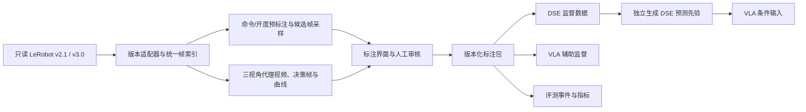

# Tron2 / LeRobot 研究数据标注实施方案

日期：2026-09-24。本文是实施设计，平台尚未安装或完成数据导入测试；第三方能力依据官方文档与部分源码核查。附带模板只是起步配置，不是已运行的标注系统。原始数据不修改。

## 1. 推荐路线

**先用自托管 Label Studio 做阶段/事件与决策帧标注，开发一个独立的 LeRobot 版本适配及导入导出工具；标注以版本化 sidecar（旁挂文件）保存。确实遇到逐帧同步、因果播放或审核效率瓶颈时，再做轻量专用界面。**

两者共用相同索引与标注规范，换界面不需要重新标注。研究价值在于标签定义、证据与验证，第一阶段不用开发通用标注平台。



不要把人工真值标签直接作为正常部署实验的 VLA 条件；只有明确命名的 oracle 实验可以这样做。

## 2. 当前样例与版本边界

| 项目 | v2.1 样例 | v3 样例 |
|---|---|---|
| 目录 | `tron2_dataset/lerobot_v2.1_examples` | `tron2_dataset/lerobot_v3_examples` |
| info.json 实际版本 | `v2.1` | `v3.0` |
| 规模 | 14 episodes / 13,432 帧 / 30 FPS | 相同 |
| 任务 | Put the banana on the plate. | 相同 |
| 轨迹表 | `meta/episodes.jsonl` | `meta/episodes/chunk-*/file-*.parquet` |
| 任务表 | `meta/tasks.jsonl` | `meta/tasks.parquet` |
| 帧数据路径 | `data/chunk-*/episode_*.parquet` | `data/chunk-*/file-*.parquet` |
| 视频路径 | `videos/chunk-*/{camera}/episode_*.mp4` | `videos/{camera}/chunk-*/file-*.mp4` |

三相机为 `cam_high`、`cam_left_wrist`、`cam_right_wrist`，以 `observation.images.` 为字段前缀；视频为 640×480、AV1。state/action 均为 18 维，左夹爪下标 7、右夹爪下标 15（从 0 开始），末两维为头部。应按 features.names 校验这些位置，不硬编码为所有 Tron2 数据集的通则。

之前对样例完整 state/action/timestamp 压缩列块的比对表明两版对应数据相同，且文件序号存在反转。使用同一个 source_episode_uuid 映射两种表示，只标一次；不得把两版分为训练与测试。发布前仍需核验完整视频对应关系与任务/来源，不只凭三列相等判定任意新数据为同一 episode。

你提及的 v3.1 在当前上游文档中确实出现，但本地样例是 v3.0。上游还引入了 `language_persistent` / `language_events` 等可选语言列。它们不等于本研究所需的结构化真值字段，也不意味着本地 openpi 依赖能直接读取。版本适配器应检查格式标识和实际 schema；未知版本显式报出未支持，不能静默按 v3.0 猜测。[上游 v3.1 文档](https://huggingface.co/docs/lerobot/main/tools)、[语言列规范](https://huggingface.co/docs/lerobot/en/language_and_recipes)。

## 3. 第三方平台选择

| 平台 | 已核实的相关能力 | 需要补齐的部分 | 建议用途 |
|---|---|---|---|
| Label Studio | ≥1.20 的官方模板支持视频与时序曲线同步，可配置多个媒体组件 | LeRobot 导入/回写、逐帧验证、因果样本生成；协作审核功能按实际版本确认 | 首选 MVP，先本地运行 |
| Hugging Face `lerobot-annotate` | 子任务时间段与高层文本标注，导出新增索引列 | 当前读取 v3 episodes parquet；多相机/曲线、DSE 枚举与审核需扩展 | 简单子任务标注或二次开发备选 |
| ATLAS | 机器人多视角、遥测曲线、动作边界及结果标注 | 已列出的原生格式不含 LeRobot，需要新适配器；因果模式需扩展 | 重视桌面机器人时序标注时试用 |
| CVAT | 图像/视频对象标注、跟踪与帧标签 | LeRobot 与机器人曲线适配 | 后续补夹爪/物体框、关键点，不作为主阶段平台 |

依据：[Label Studio 同步模板](https://labelstud.io/templates/timeseries_audio_video)、[HF 标注界面](https://github.com/huggingface/lerobot-annotate)、[ATLAS](https://github.com/TUWIEN-ASL/ATLAS-tuwienasl)、[CVAT 官方介绍](https://www.cvat.ai/academy/cvat-overview)。这些是能力筛选，不是本机安装评测结果。

HF 工具的源码 `_load_episodes()` 要求 `meta/episodes/` parquet；保存中间标注时会写入输入数据根目录，虽然最终导出使用新目录。若试用，使用工作副本或修改保存路径。视频截取含 stream-copy 路径，事件边界仍要实测。不要因为 README 写了通用支持就直接接入原始 v2.1。[源码](https://raw.githubusercontent.com/huggingface/lerobot-annotate/main/backend/app.py)

ATLAS 的某些原生格式流程会原地写数据；我们的适配器应统一写 sidecar。源码复用前检查所选 commit 的许可证。HF 独立 UI 与上游 LeRobot 内的同名自动标注命令是不同组件，不能混用安装/使用说明。

**具体决策：**先只实现 Label Studio adapter，CVAT 暂缓；HF/ATLAS 各选 1 条轨迹做可用性试验即可，不同时维护三套标注系统。

## 4. 先定义标签，再设计按钮

每个标签必须区分：实际观测、演示动作、可执行条件、事后结果。不能用一个 open/close 字段混合四种含义。

| 层级/字段 | 值或粒度 | 获得方式 | 注意事项 |
|---|---|---|---|
| episode.outcome | success / failure / aborted / unknown | 整段人工审核 | 先定义任务成功判据与观察终点 |
| attempt_id / outcome | 每次尝试与其结果 | 事件候选 + 人工 | 第一次失败但最终成功必须保留 |
| phase | idle / approach / align / closing / lift / transport / lower / releasing / retreat / recovery / unknown | 每臂时间区间 | 允许回退、跳转；不强制所有任务走同一链 |
| aperture_state | open / intermediate / closed / unknown | 实测开度与标定阈值 | 物理状态，不表示是否夹住物体 |
| demonstrated_command | open / close / hold / intermediate / unknown | action 或真实下发命令 | 数据 action 的时序和语义需确认 |
| command_event | close_request / open_request | 命令变化点 | 区别请求、开始运动、到位 |
| feedback_event | closing_started / opening_started / motion_stopped | 实测变化 | 可以与命令存在延迟 |
| close_ready / release_ready | yes / no / unknown | 因果决策帧人工标注 | 是可见证据判定，不承诺真实成功 |
| held_evidence | yes / no / unknown | 当前和历史证据 | 遮挡时保留 unknown |
| attempt_outcome | acquired / empty_grasp / dropped / wrong_object / unknown | 事后检查 | 不能回填成之前每一帧的持有真值 |
| failure_type | premature_close / empty_grasp / slip / missed_release / collision / other / unknown | 独立失败规范 | 几何无法确认的原因不强行诊断 |
| recovery | 区间、触发事件、恢复结果 | 整段审核 | 保留恢复前失败上下文 |
| 可选空间标签 | 目标/夹爪 bbox、关键点、可见性 | 抽样精标 | 不要求给所有帧画框 |

phase、事件、准备条件、持有状态是不同标注轨道，可同时存在。双臂分别标注，增加 `arm=left/right/both` 与目标 object_id；单臂 inactive 不等于标注缺失。阶段主要描述可见动作，不把主观“已到预抓取位”强当几何真值。

准备条件判断至少记录：目标是否明确、目标是否可见、是否与夹爪工作区域对齐、是否仍需调整，以及不知道的原因。明确语言指令和目标对象，否则同一图像抓不同目标的答案可能不同。释放还需考虑目标区域、支撑/高度及任务要求，不能简单设为“搬运结束就允许张开”。

**unknown 与 missing 分开。** unknown 是看过仍无法判定，属于有效的三分类答案；missing 是尚未标。三分类训练可保留 unknown，二分类损失才用 mask 排除 unknown；无论哪种，都不得将 missing 填为 no。

## 5. 不破坏原生数据的扩展方式

推荐原始目录只读，旁边增加独立研究标注包；目录名以下仅为设计示例。

```text
tron2_dataset/
  lerobot_v2.1_examples/             # 原始数据
  lerobot_v3_examples/               # 原始数据另一种表示
  tron2_annotations/
    manifest.json                   # schema/version、来源、指纹、split、工具版本
    ontology.json                   # 标签定义、枚举、适用臂、判定规则
    episode_map.parquet             # source UUID ↔ 各格式 episode/索引位置
    frame_map.parquet               # 原始帧、时间戳、每相机视频 PTS/解码帧映射
    annotation_log.jsonl            # 追加式修改/审核日志
    releases/v001/
      episodes.parquet              # 整段结果、质量、分组元数据
      attempts.parquet              # 尝试边界与结果
      segments.parquet              # 阶段/恢复区间
      events.parquet                # 点事件
      decisions.parquet             # 稀疏准备条件/持有证据标签
      spatial.parquet               # 可选
    predictions/dse_run_001/         # 模型预测，绝不覆盖人工标签
    cache/                          # 代理视频、帧图、曲线，可重建
```

标注阶段可使用 SQLite 管理当前状态与并发修订，JSONL 记录审计日志；发布时导出不可变 Parquet。JSONL 不是必须长期作为多人并发写入数据库。每条修订有独立 id、父版本、作者和时间，不用最后写入者悄悄覆盖。

核心连接键：`source_episode_uuid + frame_index`；标签再加 `arm + field`。dataset-wide `index`、文件路径和浮点 timestamp 只作为映射/校验信息，不作为跨版本唯一主键。UUID 首次登记并持久保存，转换时继承；不要由 clip 文件名或某一静止帧的哈希生成。

区间统一为 `[start_frame, end_frame_exclusive)`；点事件使用 `frame_index`。边界模糊可另存 `boundary_low_frame/high_frame`，不要制造不存在的单帧精度。帧下标必须与原始行中的 frame_index 一致，不能默认为排序后的行号。

每条标签的共同字段建议为：

```text
annotation_id, revision, source_episode_uuid, arm, field, value
frame_index 或 start_frame/end_frame_exclusive
status: proposed / reviewed / adjudicated / rejected
source: telemetry_rule / human / model_assisted
annotator_id, reviewer_id, ontology_version, created_at
evidence_mode: causal / retrospective
evidence_start_frame, evidence_end_frame
view_keys, target_object_id, reason_codes
model_run_id（仅模型建议）, proposal_id（若基于建议修改）
```

subjective annotator confidence、annotator agreement 与 DSE probability 是三个独立字段，不统称一个 confidence。

对于因果 decision 标签，强制 `evidence_end_frame <= frame_index`。对于事后事件/结果，允许更晚的证据，但禁止训练时作为该时刻的可用输入。阶段标签若依赖全轨迹才能定位，明确标记 retrospective；它可以是监督目标，却不能被宣称为在线可观测状态。

### 原生训练兼容的两种导出

**A. 训练读取时连接 sidecar（优先）**：原始 LeRobotDataset 返回帧后，wrapper 按 UUID/frame_index 加入标签及 mask。原始模型仍可直接读取原始数据；研究 loader 显式读取标注。这种兼容是“原生数据 + 研究扩展”，不是声称所有上游训练器自动认识这些标签。

**B. 发布带新列的派生 LeRobot 数据集**：在新根目录写入例如 `annotation.phase_id`、`annotation.close_ready`、`annotation.release_ready`、`annotation.label_mask`，按 `[left,right]` 保存定长向量；附带 ontology 与 provenance 表。原始 observation.state/action 的 18 维含义保持不变。新列名称是项目自定义约定，不是官方保留字段。

导出器按锁定的 LeRobot 版本更新 `meta/info.json` 的 features 和该版本需要的统计/episode 元数据；检查 v2.1 的 episode stats、v3 对应的 episode 表和全局 stats。只增加列而不改行数时也要校验长度/索引一致。优先使用该版本支持的 writer；不要把 info.json 的版本字符串改成 v3.1 当成格式迁移。

分类标签与 mask 在训练中不走动作的均值方差/分位数归一化。缺失用专用哨兵值加 mask，不用可能进入归一化损失的 NaN。数值编码写在 ontology 中。语言描述如有需要可另做上游语言列导出，但不能取代整数标签、有效性与证据范围。

两种导出都需实际用目标版本 LeRobotDataset 读取并做一个训练 batch 冒烟检查。视频可在本机只读复用；面向他人发布时拷贝或提供完整依赖清单，不能留下失效的绝对 symlink。

## 6. v2.1 / v3.0 适配器怎么实现

后端统一提供 `list_episodes()`、`read_rows(episode)`、`resolve_video(episode,camera)`、`frame_at(episode,frame,camera)` 四个接口，上层 UI 不感知格式差异。

v2.1：读取 info 模板和 episodes.jsonl，用实际 episode_index 与 chunks_size 解析数据/视频路径；加载行后按原始 frame_index 校验。不要假定当前 chunk-000 是所有未来数据的路径。

v3.0：读取所有 episodes metadata shards，以 episode 行中的 data chunk/file、dataset 区间与各相机 video chunk/file、from/to timestamp 解析位置；加载关联数据后核验 episode_index 和 frame_index。当前样例一个文件一个 episode 不代表格式要求如此；必须支持多个 episode 共用 Parquet/视频文件。任务字符串也按实际 tasks.parquet schema 读取，不能假定总存在一个名为 task 的普通列。

每次导入检查：版本、相机、feature names、state/action shape、唯一键、帧数、时间单调性、episode 边界、丢帧/缺相机与视频可解码性。无法可靠匹配的行保留异常状态，不静默补齐。原始 MCAP 若之后补遥测，必须先证明它与该 episode 的来源与时间对应关系；不能因目录相邻直接关联。

### 时间同步与代理视频

浏览器 `currentTime` 和 `frame_index / fps` 都不应成为标注真值。保存“数据行时间戳 → 原视频 PTS/解码帧 → 代理帧”的显式映射。v3 同一视频的 episode 起始偏移必须加入，三相机各自维护。

AV1 在标注机器上若解码不稳，可生成 H.264 代理；代理是缓存，不能替换训练原视频。禁止未经记录的丢帧、重复帧或变速。边界精调使用后端解码的精确帧图，快进播放可用压缩代理视频。stream-copy 切片不保证任意时间点都是精确首帧。

Label Studio 的同步模板要求设置 video.frameRate；时序数据必须使用正确的秒/时间字段。默认按索引同步可能把 30Hz 的行号当成秒。建议导出从零开始的 `HH:MM:SS.ffffff` 列，与代理视频起点一致，再把导出的时间区间映射回原始帧。映射有歧义时要求复核。[官方同步说明](https://labelstud.io/templates/timeseries_audio_video)

注意：工具上的三窗同步不证明采集时三相机曝光同步。缺少原始硬件时间戳时，记录可验证的同步范围，无法确认的事件可标 unknown。

## 7. 自动预标注：把人力用于真正困难的标签

1. **标定每只夹爪。** 用已知全开、全闭、不同宽度物体样本确定数值方向、有效范围、死区和命令—反馈延迟。不要直接假设 0=闭合，也不要把左右夹爪阈值强行设相同。
2. **分开处理 action 与 state。** 提取下标 7/15 前先验证 names；确认 action 是当前目标、增量还是未来命令，是否经过时间偏移。原始波形保留不动。
3. **施加滞回与最小持续时间。** 用进入/退出阈值区别 open/intermediate/closed；对命令变化和反馈变化分别检测事件，阈值在训练/标定集确定并记录版本。离线平滑可以生成候选，但需要记录其未来窗口，不能当作在线算法已有能力。
4. **用事件生成阶段候选。** 闭合后不自动判 transport/success；结合末端运动和视觉建议，仅将其标为 proposed，人工确认。距离阈值若无标定坐标，不虚构预抓取几何真值。
5. **抽取决策帧。** 初始可覆盖开合事件前后约 1 秒、恢复片段、保持开度但目标几何不同的帧，并混合均匀随机帧。窗口只是试标起点。事件检测不可靠时仍有随机覆盖，防止只标容易样本。
6. **人工审核与发布。** 机械信号标签抽检，重要边界逐帧校正，准备条件和失败原因按证据复核。规则版本、修改率和耗时都保存。

“下一帧发出 close”只能提供 command/intent 标签，不能自动成为 close_ready=yes。“最终成功”也不能证明之前所有闭合时刻都正确。没有电流/力字段时不生成伪造的 force/contact 标签；对新采集可增加带时间戳的遥测。

可以用 VLM 或第一版 DSE 给训练池提供候选，但测试金标准由不看模型预测的人工流程生成。模型建议单独保存，人工保留/修改有溯源。主动学习只在训练池挑选高分歧/低置信样本，不反复挑选容易的测试样本。

## 8. 两种标注工作台必须分开

### 工作台 A：全轨迹复核

显示三路视频、左右夹爪实测/命令曲线、末端高度/速度（若可可靠得到）、阶段区间、开合事件、尝试与结果。支持整段播放、逐帧定位、区间拖动、事件点编辑、快捷键、撤销与审核。允许未来证据，用于回答“发生了什么”。

每个 episode 先标整体质量/成功与否，再分 attempt，之后修正阶段和事件。失败轨迹是正常数据，不由 UI 强制塞入五阶段成功模板。

### 工作台 B：因果准备条件

一个任务对应 `(episode_uuid, decision_frame, arm, candidate_event, task/target)`。只提供当前三视角图像及固定长度历史，历史长度与 DSE 的设计一致；必要本体信息也仅截至 t。隐藏未来视频、未来 action、完整命令曲线、最终结果、自动阶段建议，以及包含 success/failure 的文件名。

最简单的实现无需修改 Label Studio 播放器：后端生成**物理截断到 t 的历史片段**或历史拼图，末帧单独展示，逐条分类为 yes/no/unknown。仅在 UI 上禁用“下一帧”而仍提供完整视频 URL 不算可靠的因果模式。

测试 readiness 标签尽量由未看过同一轨迹完整结果的另一标注者处理，避免人的记忆泄漏。训练标注若无法完全分人，记录流程限制；自动生成的候选任务随机排序、使用无结果含义的 id。

本目录 `annotation_starter/label_studio_ready.xml` 提供一个三视角当前帧分类起步配置，适合 current-frame DSE 试标；若 DSE 使用历史，按同样规则增加截断历史媒体，保持输入条件一致。`tasks.example.json` 是占位示例，不是从真机视频解码得到的标签。

### 若自制专用界面

建议 FastAPI + React/TypeScript，PyArrow 读表、FFmpeg/PyAV 解码、SQLite 保存工作状态；这些为建议技术选型，尚未安装验证。界面布局为三视角同帧窗 + 命令/反馈曲线 + 多轨时间线 + 当前标签/证据面板。

后端负责原始帧映射、因果媒体裁剪、路径白名单、原始目录只读、乐观锁和不可变 release；前端只编辑语义标签和原始帧边界。MVP 不做模型训练管理、遥操作或通用云存储平台。核心 API 可为 episodes、frame、timeline、annotation revision、review、export 六组。

## 9. 从标注到 DSE / π0.5 训练

标注发布后分别产生三种产品：

- **DSE 数据**：当前/历史三视角 + 任务/目标 + 允许使用的本体量 → ready/held/phase 的标签与 mask。训练输入不包含未来 action 或标签计算时的未来窗口。
- **VLA 监督数据**：原始 observation/action 保持原义，另带辅助分类目标和有效性。
- **模型先验数据**：冻结 DSE 的逐帧预测、置信/拒答、checkpoint hash、输入截止时刻。训练 VLA 优先使用按 episode 分组的 out-of-fold 预测，减少 DSE 对自己训练样本过拟合带来的条件分布差异。

openpi 的实现落点已经核对：

| 文件 | 所需工作 |
|---|---|
| `src/openpi/training/data_loader.py` | 在原始帧仍有 episode/frame_index 时 join sidecar，正确处理 action chunk 与 episode 末尾 mask |
| `src/openpi/training/tron2_task_config.py` | RepackTransform 显式映射标签/预测字段；只在源表新增列会被后续变换丢弃 |
| `src/openpi/policies/tron2_policy.py` | Tron2Inputs 当前主要透传 image/state/action/prompt/subtask；新增 prior/target 需显式处理 |
| `src/openpi/models/model.py` | Observation 与训练 batch 协议区分在线可用 prior 与监督 target；不要把 target 混入推理 Observation |

辅助未来事件目标可以从未来标签构造，但只进入 loss；当前条件只能使用截至 t 的预测。预测整个 action chunk 的标签必须匹配实际采样时刻，并对跨 episode/padding 位置设 mask。静态标签字段不做 action delta transform。

失败数据完整保留：标明尝试边界、失败证据、恢复开始和结果；不确定的 ready 仍可 unknown/missing。它可以训练通用策略、失败检测和恢复监督，但不要把失败闭合命令当正确策略的正样本，必要时对行为克隆 loss 使用单独质量/片段权重。保留全量数据与采样配置，避免不可复现的手工删片。

## 10. 质量控制与论文所需记录

先制定一页标签手册：每类正例/反例、unknown 条件、边界定义、任务成功条件；试标后更新 ontology 版本。对歧义大的类，优先重定义或合并，不靠投票掩盖无法观测的问题。

初始可对 20% 分层抽样片段做双人独立标注，事件附近与失败样本加密；比例是预算起点，测试关键事件建议全部复核。报告每类一致率、混淆、Cohen κ（或多人相应统计量），同时报告类别频率，避免类别极不平衡时只报一个 κ。

事件报告容差范围内的 precision/recall 与边界误差；阶段报告区间 IoU/边界差；准备条件报告 yes/no/unknown 分布和争议率。边界容差预先定义，例如 ±2 帧作为初始分析尺度，同时展示不同容差的敏感性，不称其为物理真值精度。

最终测试按 episode/session/物体分组冻结；格式转换副本、同次尝试的恢复片段、邻接帧不能跨池。阈值标定、自动规则拟合和模型辅助标注只访问允许的训练/校准池。人类可以完整标注测试，但不得据其错误反复调整标签规范后只保留有利结果；修订需可追溯并全量一致应用。

记录每类人工分钟数、规则自动覆盖率、人工修改率、抽检错误率、样本采样概率/策略。人工密集采样集适合训练，不直接用其类别比例估计真机自然发生率；额外保留均匀/全事件评测集。

## 11. 实施顺序与验收

以下是小团队开发工作量估计，不含大规模人工标注或未知环境问题。

| 阶段 | 预计工作量 | 交付与结束条件 |
|---|---|---|
| P0 标签与版本冻结 | 1–2 人日 | ontology v0.1、原始数据指纹、UUID 映射、成功/失败定义 |
| P1 数据适配及媒体索引 | 2–4 人日 | 两种版本能解析同一 14 条轨迹；任意帧可找回三视角与曲线 |
| P2 Label Studio 两类任务 | 2–4 人日 | 全轨迹与因果决策任务分别导入；一个完整标注—回写回合 |
| P3 规则预标注与人工试标 | 2–3 人日 + 标注工时 | 开合事件候选、争议分析、v0.2 手册；不用这 14 条样例宣称泛化 |
| P4 训练接入与发布 | 2–4 人日 | sidecar join、DSE/VLA batch 检查、固定 release、复现清单 |
| 可选专用 UI | 额外约 1–3 人周 | 仅在工具试标暴露明确瓶颈后启动 |

强制验收项目：

1. 原始文件哈希不变；v2/v3 同源帧得到同一标签，文件顺序重排不影响结果。
2. 用专门 fixture 验证多个 episode 共用同一 data/video shard，不能只过当前一文件一轨迹样例。
3. 首/尾/事件附近帧人工核对；映射输出精确原始帧 id；可测的媒体定位偏差应不超过预设一帧预算。采集曝光同步另行报告，不能由该测试替代。
4. 代理生成不悄悄改变帧数或顺序；缺失视角与时间异常可见、可拒绝，不静默错配。
5. 区间半开边界、点事件、双臂、重试回退、unknown/missing、重复修订与审核状态都能 round-trip。
6. 因果任务提供的所有媒体/曲线均截至决策帧；测试中加入截止后一帧有明显结果的案例，确认不可见。
7. 原始样本没有标注时仍可读取；有标注时 join 键唯一且 mask 正确；不会把监督 target 放进正常推理输入。
8. 派生数据用所选 LeRobot 版本重读，至少生成一个 DSE batch 与一个 VLA batch，检查维度、枚举、归一化与 chunk padding。
9. 固定工具 commit、依赖、ontology、采样配置、规则阈值与 release；同样输入再次导出得到同样标签表内容。

**当前最合适的第一轮工作量是：这 14 条样例只建立一次完整标注闭环，选有动作变化的轨迹先验证技术，再补充独立失败/恢复和困难反例数据。** 在此之前，不值得给全部数据逐帧画框，也不应将自动夹爪阈值标签当成准备条件金标准。
